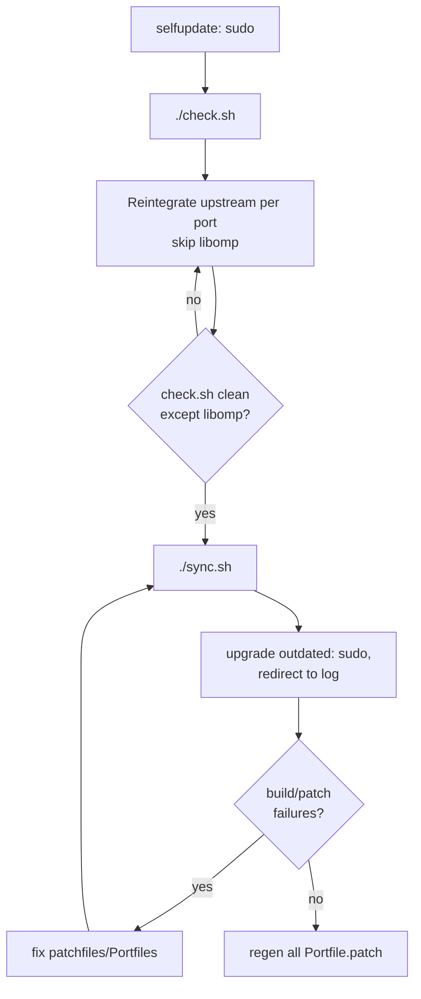

# MacPorts (Natron) Upgrade

## Overview
This skill drives the upgrade of Natron's local MacPorts portfile overlay (`tools/MacPorts/`) against upstream MacPorts: refresh upstream, detect diverged ports with `check.sh`, reintegrate upstream changes onto Natron's customizations, rebuild installed ports, fix failing patchfiles, and regenerate every `Portfile.patch`.

## Usage
Use this skill when the user asks to:
- "upgrade the local MacPorts for Natron" / "update the Natron ports"
- run `check.sh` and fix obsolete Portfiles
- reintegrate upstream MacPorts changes after `sudo port selfupdate`
- fix a Natron patchfile that no longer applies after a MacPorts sync
- regenerate `Portfile.patch` files (unified diffs of `Portfile.orig` → `Portfile`)
- build Natron and produce a macOS (arm64) `.dmg` via `tools/jenkins/launchBuildMain.sh`

## Core Concepts

Each port dir under `tools/MacPorts/<category>/<port>/` follows this convention:
- `Portfile` — the effective portfile MacPorts uses (upstream + Natron customizations).
- `Portfile.orig` — snapshot of the **upstream** MacPorts Portfile it was last synced from. This is the marker `check.sh` compares against.
- `Portfile.patch` — `diff -u Portfile.orig Portfile`, i.e. Natron's customizations as a unified diff.
- `files/` — patchfiles referenced by the Portfile.

Key tooling in `tools/MacPorts/` (run from that dir):
- `./check.sh` — for every local `Portfile`, compares its `Portfile.orig` against the freshly-synced upstream tree. Prints each obsolete port plus the suggested reintegration command, and reports missing/updated `files/*`.
- `./sync.sh` — `rsync`s the whole repo into the overlay `/opt/MacPorts-Natron` and runs `portindex`.
- `./clean.sh` — removes `work/` build dirs and editor backups.

Layout facts:
- Overlay MacPorts reads: `/opt/MacPorts-Natron` (declared first in `/opt/local/etc/macports/sources.conf`).
- Upstream ports tree (what `check.sh` diffs against): under `/opt/local/var/macports/sources/rsync.macports.org/.../tarballs/ports` — `check.sh` locates it as `$ports`.

## CRITICAL constraint — libomp is pinned

`lang/libomp` is deliberately pinned to **11.1.0** (see `lang/libomp/README.md`) because of an OpenMP regression affecting Natron.

The freeze applies **only to the effective `lang/libomp/Portfile`** — its `Portfile.orig` still mirrors upstream like every other port.

- You **MUST NOT** modify the effective `lang/libomp/Portfile` (keep it pinned to 11.1.0) unless the user explicitly says it is OK to upgrade libomp. That means: skip the `cp upstream → Portfile` copy and the re-patch step for libomp.
- **Exception — syntax/compatibility fixes are allowed.** You **MAY** edit the pinned `Portfile` when a MacPorts change requires it to keep parsing/building (e.g. a bumped `PortGroup` version, a renamed or removed Tcl command, a changed/deprecated keyword). This is not a version upgrade — the goal is to keep the 11.1.0 pin working on the current MacPorts base. Make the minimal syntax change; do **not** change `version`, `checksums`, `master_sites`, or the fetched sources. When the source itself is unchanged, prefer copying just the needed syntax fix from upstream's Portfile rather than adopting the whole file.
- You **SHOULD** still update `lang/libomp/Portfile.orig` to the current upstream version (Portfile.orig always represents upstream), and regenerate `lang/libomp/Portfile.patch` in Step 7. That patch becomes the intentional "downgrade" diff (upstream → pinned 11.1.0), which is expected and correct.
- Because `Portfile.orig` then matches upstream, `check.sh` stops flagging libomp. If you leave `Portfile.orig` stale instead, `check.sh` will keep reporting libomp as obsolete.
- libomp patchfiles **SHOULD** keep a version-specific name (e.g. `patch-libomp11-...diff`) so upstream syncs cannot overwrite them.

## Compiler pin (clang)

Natron's app build (`tools/jenkins/compiler-common.sh`) auto-selects a MacPorts `clang-mp-*`. The right version depends on the macOS version — **verify, don't assume the howto**:

- **Legacy (howto text):** older macOS pinned `clang_version=16` (`11` on 10.6) for two reasons — clang-17/18 once mis-linked `-fopenmp` against `@rpath/libc++.1.dylib`, and clang-19+ emits `__kmpc_dispatch_deinit`, which was absent from the pinned libomp 11.1.0.
- **Current (macOS 26 / Darwin 25 — verified):** both reasons are resolved. `clang++-mp-17 -stdlib=libc++ -fopenmp` links against `/usr/lib/libc++.1.dylib` correctly (no `@rpath`), and the missing OpenMP symbol is now backported into libomp 11.1.0 (`files/patch-libomp11-add-kmpc_dispatch_deinit.diff`). So the jenkins default (**clang-mp-17**, the top uncommented entry in `compiler-common.sh`) builds correctly, and clang-16 (no longer in the Darwin≥25 fallback, and possibly not installed) need not be forced.
- **Verify on the running OS before trusting a pin:**
  ```bash
  printf 'int main(){}\n' > /tmp/t.cpp
  clang++-mp-17 -stdlib=libc++ -fopenmp /tmp/t.cpp -o /tmp/t && otool -L /tmp/t | grep -E 'libc\+\+|libomp'
  ```
  Expect `/usr/lib/libc++.1.dylib` and `/opt/local/lib/libomp/libomp.dylib`. If a future clang regresses the libc++ path, pin a known-good `clang-mp-N` by editing the `compiler-common.sh` selection chain.
- MacPorts' *port-build* default clang is separate: derived in `clang_compilers.tcl` from `${os.major}` + `${compiler.cxx_standard}` (Darwin≥25 → clang-22). That builds the dependency ports; the Natron app build uses `compiler-common.sh`'s choice.
- `clang_dependency` PortGroup blacklists all `macports-clang-*`, forcing those ports (e.g. `lang/libomp`, `net/curl`) onto the system Apple clang.

## Privilege note
`sudo port ...` cannot be run by the agent. For every `sudo` step you **MUST** print the exact command, ask the user to run it, and wait for them to confirm/paste output before continuing.

## Workflow



### Step 0 — Preconditions
Confirm the working directory is the MacPorts repo root (it contains `check.sh`, `sync.sh`, and category dirs like `lang/`, `graphics/`). All commands below run from there unless noted.

### Step 1 — Refresh MacPorts + upstream ports tree (sudo)
Ask the user to run:
```bash
sudo port selfupdate
```
This updates MacPorts base and syncs the upstream ports tree that `check.sh` diffs against.

### Step 2 — Detect diverged ports
```bash
./check.sh
```
For each diverged port it prints `<path>/Portfile is obsolete:` and a suggested `cp ...; patch < Portfile.patch` command, plus any missing/updated `files/*`.

### Step 3 — Reintegrate upstream changes (fix everything)
`Portfile.orig` always becomes the upstream version. For **each** obsolete port (`$P` = the port dir, `$ports` = upstream tree from `check.sh`):
```bash
cp "$ports/$P/Portfile" "$P/Portfile.orig"   # baseline := new upstream (ALL ports)
cp "$ports/$P/Portfile" "$P/Portfile"        # start from new upstream
( cd "$P" && patch Portfile < Portfile.patch )   # re-apply Natron customizations
```
- Naming `Portfile` as the patch target is deterministic (avoids patch guessing between `Portfile.orig`/`Portfile`).
- If hunks reject (`.rej` files), open each `.rej`, merge the change into `Portfile` by hand to fit the new upstream context, then delete the `.rej` (and any `.orig` left by `patch`).
- Copy any `files/*` that `check.sh` reported as missing or updated.

**libomp exception:** for `lang/libomp` do the first line only (`cp upstream → Portfile.orig`); **skip** the second `cp` and the re-patch so the pinned `Portfile` (11.1.0) is preserved. See the libomp constraint above.

Re-run `./check.sh` and repeat Step 3 until it reports nothing obsolete.

### Step 4 — Publish to the overlay
```bash
./sync.sh
```
Fix any `portindex` parse errors it reports (these are Tcl errors in a `Portfile`, e.g. a stray token like `+patchfiles-append`). Re-run `./sync.sh` until `portindex` parses all ports.

### Step 5 — Upgrade installed ports (sudo, capture output)
Ask the user to run and share the log. Prefer the **per-port loop** so one failing port does not stop the rest (best for the fix-and-loop in Step 6):
```bash
sudo -v; for p in $(port -q echo outdated | awk '{print $1}'); do echo "===== upgrading $p ====="; sudo port -v upgrade "$p"; done 2>&1 | tee /tmp/natron-port-upgrade.log
```
- `port -q echo outdated` lists just the outdated port names; `awk '{print $1}'` strips version columns.
- `sudo -v` primes the credential cache so the loop does not re-prompt; no `set -e`, so failures are logged and skipped.

Single-pass alternative (MacPorts handles dependency order, but stops at the first hard failure):
```bash
sudo port -v upgrade outdated 2>&1 | tee /tmp/natron-port-upgrade.log
```

### Step 6 — Fix remaining issues, then loop
Read `/tmp/natron-port-upgrade.log`. For each failure:
- **Patch phase failure** (`N out of M hunks failed`): the Natron patchfile no longer matches the new upstream source. Inspect the per-port build log at `/opt/local/var/macports/logs/<mangled-path>/<port>/main.log` and the extracted source under `/opt/local/var/macports/build/`, then fix the patchfile's context to match the new source (see references note below).
- **Configure/build failure**: address the root cause in the `Portfile` or a `files/*` patch.
- After fixing: `./sync.sh`, ask the user to `sudo port clean <port>`, then re-run Step 5.

Loop Steps 5–6 until `sudo port -v upgrade outdated` completes with no failures.

### Step 7 — Regenerate all Portfile.patch
Rewrite every `Portfile.patch` as the unified diff of its `Portfile.orig` → `Portfile`:
```bash
skills/macports-natron-upgrade/scripts/regen-portfile-patches.sh .
```
This is safe for `lang/libomp`: it only rewrites `Portfile.patch`, never the pinned `Portfile`. Review `git status`/`git diff`, then commit per-package (each port dir is its own change) if the user asks.

## Fixing a failing patchfile
The failure is almost always a **context mismatch**: the patch was written for a different source version than the Portfile pins/fetches.
1. Read the port's `main.log` to see which patchfile and hunk failed.
2. Compare the patch's context lines against the actual file in the extracted `work/` source.
3. Edit the patchfile so its context (and `@@` ranges) match the real source, preserving the intent of the `+`/`-` changes.
4. Verify without touching the install prefix:
   ```bash
   cp <extracted-source-file> /tmp/t/<relpath> && ( cd /tmp/t && patch -t -N -p0 < <patchfile> )
   ```
   Expect exit 0 and no `.rej`.

## Building Natron (produce a DMG)

The full macOS build (Natron + OpenFX plugins, bundled into a `.dmg`) is driven by `tools/jenkins/launchBuildMain.sh`, which runs 6 steps: (1) checkout sources, (2) build plugins, (3) build Natron, (4) build installer/DMG, (5) unit tests, (6) archive/cleanup.

**Prerequisites** (installed into `/opt/local` via MacPorts — sudo; see the howto's install list):
- Full SDK: qt5, python310, **py310-pyside2** (provides the shiboken2 generator), openimageio, ffmpeg, cairo, librsvg, boost, openexr, seexpr/seexpr211, ImageMagick, etc.
- **OSMesa** at `/opt/osmesa` (or `$SDK_HOME/osmesa`), built separately via `osmesa-install.sh`.
- Symlinks the build checks (else it hard-exits): `…/site-packages/shiboken2_generator/shiboken2-<PYVER>` **must resolve to a real file**, `/opt/local/bin/shiboken2 → shiboken2-<PYVER>`, and `${SDK_HOME}/Library/lib → Frameworks`.
- The `/opt/MacPorts-Natron` overlay declared in `sources.conf` (this skill's upgrade workflow).

**Launch** (RB-2.6, release; runs **without sudo** — builds into `$WORKSPACE`; long-running, so background it):
```bash
cd tools/jenkins
nohup env NOUPDATE=1 WORKSPACE=$HOME/Development/workspace \
  DISABLE_BREAKPAD=1 NATRON_LICENSE=GPL \
  GIT_URL=https://github.com/NatronGitHub/Natron.git GIT_BRANCH=RB-2.6 \
  UNIT_TESTS=false BUILD_NAME=natron_github_RB2 BUILD_NUMBER=1 \
  COMPILE_TYPE=release MKJOBS=8 \
  ./launchBuildMain.sh > /tmp/natron-build.log 2>&1 &
```
`set -e` means it stops at the first error; the log tail shows the failing step. Monitor with `tail -f /tmp/natron-build.log`.

- **arch:** on Apple Silicon it targets arm64 natively (no flag needed; the howto's `BITS=Universal` is for older/Intel setups).
- **compiler:** auto-selected by `compiler-common.sh` (clang-mp-17 on macOS 26 — see Compiler pin).
- **output DMG:** under `$WORKSPACE/builds_archive/$BUILD_NAME/$BUILD_NUMBER/` (`build-OSX-installer.sh` writes `<INSTALLER_BASENAME>.dmg`).
- **partial runs:** `BUILD_FROM`/`BUILD_TO` restrict which of the 6 steps run; `DEBUG_SCRIPTS=1` keeps prior binaries to resume.
- **release build:** set `RELEASE_TAG=x.y.z NATRON_DEV_STATUS=STABLE NATRON_BUILD_NUMBER=1` instead of a branch CI build.

**Common prerequisite failure:** `Error: broken MacPort install … shiboken2` means `py310-pyside2` isn't installed (or its generator symlink dangles) → `sudo port -v -N install py310-pyside2`, then ensure the two shiboken symlinks above resolve to real files.

## Quick reference
| Action | Command |
|---|---|
| Refresh upstream (sudo) | `sudo port selfupdate` |
| Detect diverged ports | `./check.sh` |
| Reintegrate one port | `cp $ports/$P/Portfile $P/Portfile.orig; cp $ports/$P/Portfile $P/Portfile; (cd $P && patch Portfile < Portfile.patch)` |
| Publish to overlay | `./sync.sh` |
| Upgrade installed, per-port (sudo) | `sudo -v; for p in $(port -q echo outdated \| awk '{print $1}'); do echo "== $p =="; sudo port -v upgrade "$p"; done 2>&1 \| tee /tmp/natron-port-upgrade.log` |
| Upgrade installed, single pass (sudo) | `sudo port -v upgrade outdated 2>&1 \| tee /tmp/natron-port-upgrade.log` |
| Clean one port (sudo) | `sudo port clean <port>` |
| Regenerate all patches | `skills/macports-natron-upgrade/scripts/regen-portfile-patches.sh .` |
| Per-port build log | `/opt/local/var/macports/logs/<mangled-path>/<port>/main.log` |

## Common mistakes
- **Upgrading the libomp Portfile.** Never bump the libomp *version* (change `version`/`checksums`/sources) without explicit user approval. Syntax/compatibility edits required by a MacPorts change are allowed. Its `Portfile.orig` still tracks upstream and its `Portfile.patch` is regenerated normally.
- **Running sudo yourself.** The agent cannot sudo — always hand sudo commands to the user.
- **Leaving `.rej`/`.orig` litter.** After resolving rejects, delete leftover `*.rej` and `patch`-created `*.orig` files before regenerating `Portfile.patch`.
- **Regenerating patches before reintegration.** Do Step 7 last, after `Portfile`/`Portfile.orig` are settled, or the diffs will be wrong.
